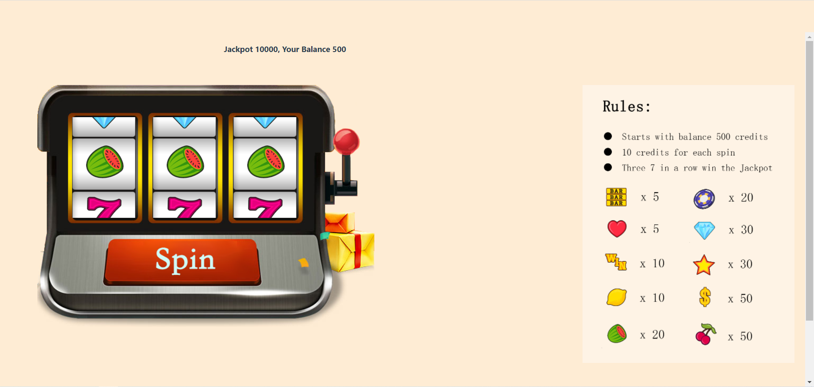

## Name
777 Jackpot

## Summary
777 Jackpot looks exactly same as 777 spin game. But we reconstruct it with Aleo lanaguage and toolsets to make the players info and behaviors in betting process not as transparent as public blockchains.


## Application Values
1. This project has a nice and neat UI and is strong recommended as an  amusement tool for Aleo community.

2. This project utilizes Decentralized Identity (DID) thru login with address of Aleo Wallet as the unique Digital Identity. In theory, players can use the same identity for various community activities within Aleo ecosystem or even across web3 networks which are Aleo compatible.

3. This project tries to utilize features of Aleo Wallet as many as possible, such as creating Wallet, creating Account, deduct, withdraw and etc.

## User Flow
-- Player opens the 777 Jackpot url, login onto the Wallet and will get 500 credits. 

-- Player click mouse to spin.




## Project Structure
`\flask_Leo` Server and Leo

  `-\leo_program` Leo
  
`\web_dev`client page


## project configuration
Modification of server domain name configuration in the client:

`web\src\config\api.ts` Change the `baseURL` in the path to your domain name

`web\src\api\Wallet.ts` Modify the `getApiUrl` method in the path to your domain name


## How to Run
```bash
leo run increase_public 'address' 'amount'
```
Enter the user address, the number of chips to be added, add chips, and return the user address and chips

```bash
leo run reduce_public 'address' 'amount'
```
Enter the user address, the number of chips to be deducted, deduct the betting amount, reduce the chips, and return the user address and chips

```bash
leo run transfer_lottery 'from_address' 'dealer' 'money' 'lottery_money' 'c1' 'c2' 'c3'
```
Enter the user's wallet address, receiving address, balance, winning amount, carousel 1 value, carousel 2 value, carousel 3 value, and lottery verification information

```bash
leo run transfer_accounts
```
Enter the outbound address, inbound address, and transaction amount to complete the game and make the transfer


## How to Build

To compile this Aleo program, run:
```bash
aleo build
```


## Parameter Description
```bash
 token => {
    owner: address,
    gates: u64,
    amount: u64,
}

 Lottery   => {
    owner: address,
    gates: u64,
    amount: u64,
    lottery_money:u64,
    c1: u64,
    c2: u64,
    c3: u64,
}

  Transfer  => {
    owner: address,
    gates: u64,
    from_address: address,
    to_address: address,
    money: u64,
}
```

`owner` User wallet address

`amount` user Balance

`lottery_money` Winning amount

`c1` Turntable 1 value

`c2` Turntable 2 value

`c3` Turntable 3 value

`from_address` Transfer out address

`to_address` Transfer to address


